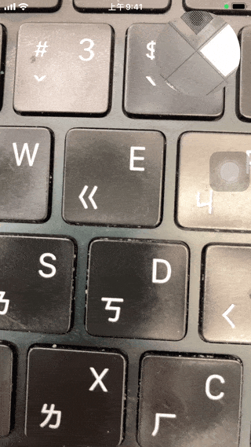

# WWDualCamera

[](https://developer.apple.com/swift/) [](https://developer.apple.com/swift/)  [](https://developer.apple.com/swift/) [](https://developer.apple.com/swift/)

### [Introduction - 簡介](https://swiftpackageindex.com/William-Weng)
- [Simple generation of dual camera functions.](https://blog.csdn.net/u011686167/article/details/130795604)
- [簡單的產生雙鏡頭功能。](https://www.jianshu.com/p/95f2cd87ad83)



### [Installation with Swift Package Manager](https://medium.com/彼得潘的-swift-ios-app-開發問題解答集/使用-spm-安裝第三方套件-xcode-11-新功能-2c4ffcf85b4b)
```bash
dependencies: [
    .package(url: "https://github.com/William-Weng/WWDualCamera.git", .upToNextMajor(from: "1.2.0"))
]
```

### Parameter - 可用參數
|參數|說明|
|-|-|
|multiSession|AVCaptureMultiCamSession|
|isMultiCamSupported|是否支援多鏡頭同時動作|
|isRunning|是否正在預覽畫面|
|supportCount|當前設備支持的最大同時使用鏡頭數|

### Function - 可用函式
|函式|說明|
|-|-|
|start()|開始執行|
|stop()|關閉執行|
|addInputs(_:isConnections:)|加入額外裝置輸入 (可以不連接)|
|addOutputs(_:isConnections:)|加入額外資源輸出 (可以不連接)|
|configuration(action:)|相關的設定 (切換硬體)|
|sessionOutputs(delegate:inputs:videoGravity:stabilizationMode:)|產生輸出資訊|
|removeInputs(_:)|移除輸入裝置|
|removeAllInputs()|移除所有輸入裝置|
|removeOutputs(_:)|移除輸出裝置|
|removeAllOutputs()|移除所有輸出裝置|
|canAddConnection(_:)|加入新的連接|
|canRemoveConnection(_:)|安全的移除連接|
|cost()|硬體 / 系統的用量指標|

### Example
```swift
import UIKit
import AVFoundation
import WWDualCamera

final class ViewController: UIViewController {

    @IBOutlet weak var mainView: UIView!
    @IBOutlet weak var subView: UIView!
    
    private var cameraOutputs: [AVCaptureVideoDataOutput] = []
    private var cameraPreviewLayers: [AVCaptureVideoPreviewLayer] = []
    
    override func viewDidAppear(_ animated: Bool) {
        super.viewDidAppear(animated)
        initSetting()
        _ = WWDualCamera.shared.start()
    }
}

private extension ViewController {
    
    func initSetting() {
        
        let inputs: [WWDualCamera.CameraSessionInput] = [
            (frame: mainView.frame, deviceType: .builtInWideAngleCamera, position: .back),
            (frame: subView.frame, deviceType: .builtInWideAngleCamera, position: .front),
        ]
        
        let outputs = WWDualCamera.shared.sessionOutputs(inputs: inputs)
        
        for (index, info) in outputs.enumerated() {
            
            guard let output = info.output,
                  let previewLayer = info.previewLayer
            else {
                return
            }
            
            if (index == 1) { previewLayer.cornerRadius = subView.frame.width * 0.5 }
            
            cameraOutputs.append(output)
            cameraPreviewLayers.append(previewLayer)
            view.layer.addSublayer(previewLayer)
        }
    }
}
```

